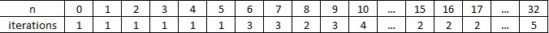

# Algorithmic-problems
Resolve a set of problems using appropriate design and most efficient algorithm.

These programming challenges are part of the third project of UDACITY's [Data Structures & Algorithms Nanodegree Program](https://www.udacity.com/course/data-structures-and-algorithms-nanodegree--nd256).

These problems solve a variety of topics related to basic algorithms. The objective is a clean and efficient solution in Python with an explanation of the efficiency of the code and design choices.

## Problem 1: Finding the Square Root of an Integer
Find the square root of the integer without using any Python library. You have to find the floor value of the square root.

  - Design choice: We know that for n> 1 we have sqrt(n) < n. And we are looking for 'a' such as `a <= sqrt(n) < a+1`. This is equivalent to `a^2 <= n < (a+1)^2`. The algorithm is therefore built to identify such 'a' amongst the candidate [0...n-1] for n>1. I follow a divide and conquer strategy similar to binary search with a recursive approach.
    - if the list of candidates contains one element then this element is the solution
    - else choose the central element 'm' in the list of candidates.
    - if m^2 > n then look for the solution is [0...m-1]
    - if n > (m+1)^2 then look for the solution in [m+1,..,n-1]
    - if m^2 <= n < (m+1)^2 then the solution is m
  
  for n = 0 we have 0 and for n = 1 we have 1.
  
  - Time complexity:
  We know that such algorithm is of complexity O(log(n)).
  We can verify this looking at the first elements:
  

  
  so we have roughly for 2^k < n < 2^(k+1), k iterations on average. This indicates a complexity of O(log(n)).

  - Space complexity: O(n) since we use a list of candidates of size n

## Problem 2: Search in a Rotated Sorted Array
You are given a sorted array which is rotated at some random pivot point. Example: [0,1,2,4,5,6,7] might become [4,5,6,7,0,1,2]. You are given a target value to search. If found in the array return its index, otherwise return -1. You can assume there are no duplicates in the array and your algorithm's runtime complexity must be in the order of O(log n).

  - Design choice: The idea is to take advantage of the sorted array to perform binary search which complexity is O(log n). However we must adapt the approach since the array has a random pivot point. During binary search, we will check whether the mid index is before or after the pivot and adjust appropriately to the proper ordered sequence, either on the right (from start to mid index) or on the left (from mid index to end). If the target is within that ordered segment, we are back to a classic binary search.
  Otherwise, the problem is narrowed to a halved list which includes a random pivot, a situation similar to the starting point. The search is pursued recusively.
  
  - Time complexity: The approach is identical to a binary search of complexity O(log n).
  
  - Space complexity: This algorithm has constant space. Space complexity does not change depending on the size of the array.
  
  
  ## Problem 3: Rearrange Array Elements
Rearrange Array Elements so as to form two number such that their sum is maximum. Return these two numbers. You can assume that all array elements are in the range [0, 9]. The number of digits in both the numbers cannot differ by more than 1. You're not allowed to use any sorting function that Python provides and the expected time complexity is O(nlog(n)).

  - Design choice: The approach is to first sort the input list. From there, we can easily build the solution. The largest numbers will start with the largest digits in the list. We want to distribute the largest digits between the 2 solution numbers so that to maximize the combination until all digits have been distributed. This will ensure the 2 solution numbers have identical number of digits (input list with even number of digits) or different by just 1 (input list with odd number of digits).
  
  - Time complexity: MergeSort function guarantees a complexity of O(nlog(n)). The assembliy of the 2 solution numbers from the ordered list is O(n) since we traverse the list once. Therefore the overall operation is O(nlog(n)) in the worst case.
  
  - Space complexity: MergeSort function implies a space complexity of O(n). The assembly of the 2 solution numbers is also O(n). Overall, space complexity is O(n).

## Problem 4: Dutch National Flag Problem
Given an input array consisting on only 0, 1, and 2, sort the array in a single traversal. You're not allowed to use any sorting function that Python provides.
 
 - Design choice: Since we have only 3 classes (0,1,2), we can easily insert the 0 and 2 at the extremities but lack information on 1 since we must sort in a single pass.
 I choose to prefill an array with '1's and will replace with 0 or 2 appropriately on the extremities while traversing the unsorted array.
 
  - Time complexity: Since we traverse the list only once to return the solution, the complexity is O(n).
  
  - Space complexity: O(n) since we store the solution in a list of same size as the input.

## Problem 5: Autocomplete with Tries
See jupyter notebook.
  - Design choice:
  - Time complexity:
  - Space complexity:

## Problem 6: Max and Min in a Unsorted Array
Look for smallest and largest integer from a list of unsorted integers. The code should run in O(n) time. Do not use Python's inbuilt functions to find min and max.

  - Design choice: Sorting would allow to identify the lowest and highest elements. However I will not sort the list as this takes O(nlog(n)). I choose to traverse the list once and store the lowest and highest elements as we go through each element of the list.
  
  - Time complexity: Since we traverse the list only once to return the solution, the complexity is O(n). This is more efficient as sorting since we do not have to sort all the elements.
  
  - Space complexity: This algorithm has constant space. Space complexity does not change depending on the size of the array.
  
  
  
## Problem 7: HTTPRouter using a Trie
For this exercise we are going to implement an HTTPRouter like you would find in a typical web server using the Trie data structure.
  - Design choice:
  - Time complexity:
  - Space complexity:
